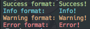

<br><br>

<h1 align="center">Cfmt</h1>

<p align="center">
  <a href="/LICENSE"></a>
  <a href="https://goreportcard.com/report/github.com/mingrammer/cfmt"></a>
  <a href="https://godoc.org/github.com/mingrammer/cfmt"></a>
  <a href="https://travis-ci.org/mingrammer/cfmt"></a>
  <a href="https://codecov.io/gh/mingrammer/cfmt"></a>
</p>

<p align="center"> Contextual fmt </p>

<br><br><br>

It provides contextual formatting functions that have nearly identical usage of the fmt package. The ideas were borrowed from bootstrap's contextual color classes.

## Installation

```
go get github.com/mingrammer/cfmt
```

## Usage

```go
package main

import (
	"log"

	"github.com/mingrammer/cfmt"
)

func main() {
	cfmt.Success("User was created successfully")
	cfmt.Infoln("Here are some candidates")
	cfmt.Warningf("%s is not valid integer value\n", "123a")
	log.Fatal(cfmt.Serrorf("Only numeric is allowed, got %s", "123.456a"))
}
```



## Contextual Functions

> Note: cfmt.Errorf function does not do same things to fmt.Errorf, but to fmt.Printf with red colored text.

- Success (Green)
  - Fsuccess, Fsuccessf, Fsuccessln
  - Success, Successf, Successln
  - Ssuccess, Ssuccessf, Ssuccessln
- Info (Cyan)
  - Finfo, Finfof, Finfoln
  - Info, Infof, Infoln
  - Sinfo, Sinfof, Sinfoln
- Warning (Yellow)
  - Fwarning, Fwarningf, Fwarningln
  - Warning, Warningf, Warningln
  - Swarning, Swarningf, Swarningln
- Error (Red)
  - Ferror, Ferrorf, Ferrorln
  - Error, Errorf, Errorln
  - Serror, Serrorf, Serrorln

## License

MIT
